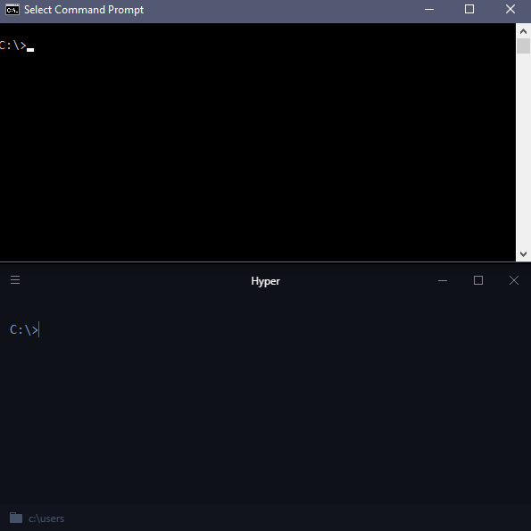

# hyper-single-instance

Extension which prevents the creation of multiple [**Hyper.app**](https://hyper.is/) instances.

Calls to `hyper.exe` and the `Hyper` context-menu option will create new tabs in the existing instance of Hyper.



## Installation

To install, execute:
```
hyper i hyper-single-instance
```

Or edit `~/.hyper.js` manually and add `"hyper-single-instance"` to `plugins`:

```
plugins: [
  "hyper-single-instance",
],
```
